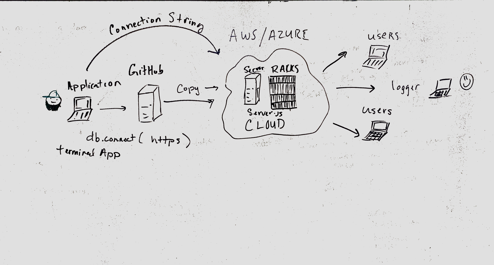

# LAB - 

## Project Name

### Author: Student/Group Name

### Links and Resources
* [submission PR](https://github.com/jeremy-401-advanced-javascript/Lab19/pull/3)
* [travis](http://xyz.com)
* [back-end](http://socketdemo-env.ke93y4czed.us-east-2.elasticbeanstalk.com/) (when applicable)

### Modules
#### `modulename.js`
`theword.js`
##### Exported Values and Methods
`console.log with faker message

### Setup
#### `.env` requirements
* `PORT` - 3000

#### Running the app
* `node app.js`
* `node console.js`
* Endpoint: `Server on AWS`
  * Sends out a faker message to sever hosted on AWS
* Endpoint: `Server on AWS`
  * Retrieves a message sent from the app.
  
#### Tests
* How do you run tests?
* What assertions were made? 🤔

#### UML

